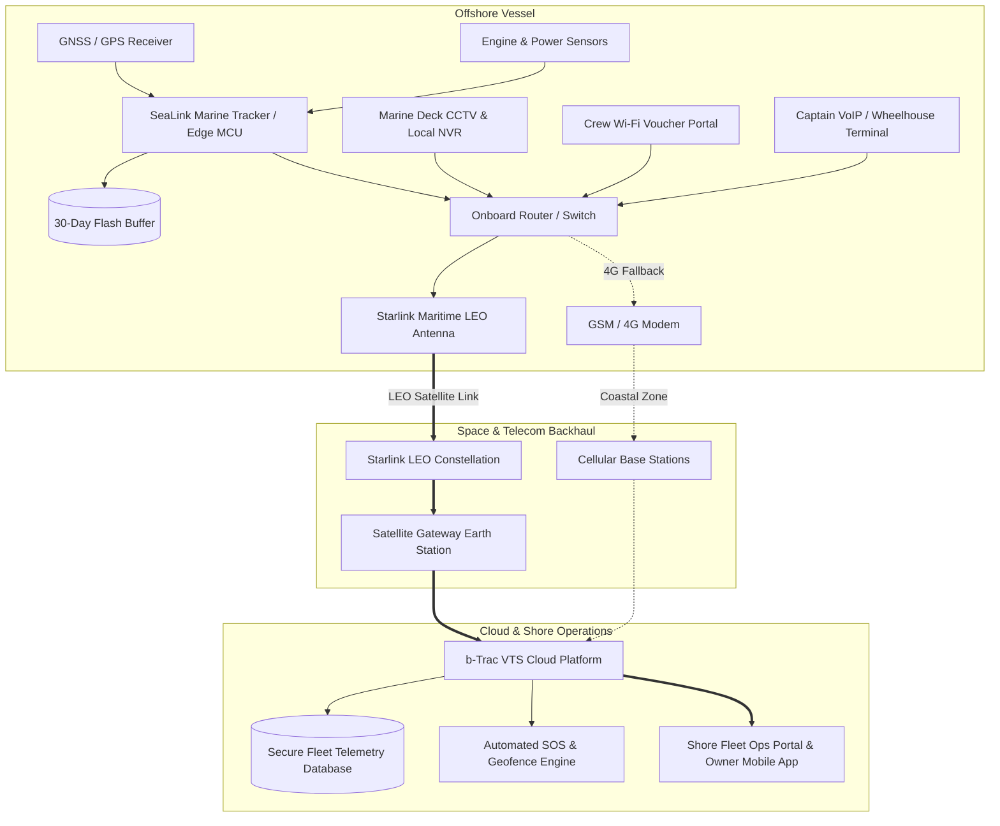

# SeaLink by b-Trac 🌊⚓

[](https://mahadi-ma-ak.github.io/SeaLink/)
[](https://github.com)
[](https://github.com)
[](https://leafletjs.com/)
[](https://www.starlink.com/)

> **Next-Generation Connected Vessel Tracking, Safety & Maritime IoT Platform**  
> Designed for offshore mechanized fishing fleets, commercial trawlers, and maritime operations across the Bay of Bengal.

---

## 📌 Live Deployment

🌐 **Live Website**: [https://mahadi-ma-ak.github.io/SeaLink/](https://mahadi-ma-ak.github.io/SeaLink/)  
*(Replace with your GitHub repository URL if hosted under a different account)*

---

## 📖 Executive Summary

Bangladesh's Department of Fisheries registers over **30,300+ mechanized and commercial fishing vessels** manned by more than **270,000 crew members**. As these vessels travel 50–120+ km offshore into the Bay of Bengal, conventional GSM/cellular networks drop completely.

**SeaLink by b-Trac** bridges this deep-sea connectivity chasm by integrating:
1. **Ruggedized Edge Marine Trackers** with offline flash telemetry logging.
2. **Low Earth Orbit (LEO) Satellite Backhaul** (Starlink Maritime) paired with cost-effective cellular fallback.
3. **B-Trac’s Centralized VTS Cloud Infrastructure** to deliver continuous location tracking, SOS distress dispatch, operational VoIP/messaging, on-demand deck surveillance, and controlled crew internet.

---

## 🚀 Key Features & Capabilities

### 1. 🗺️ Tactical Maritime Live Map
* Interactive tactical maritime dashboard powered by **Leaflet**.
* Visualizes real-time simulated vessel tracks, waypoint histories, harbor anchorages (Chittagong, Cox's Bazar), and Exclusive Economic Zone (EEZ) boundaries.
* Dark-mode cartography with custom nautical styling, vessel heading indicators, and emergency hazard zones.

### 2. 📡 Real-Time Telemetry & Telemetry Engine
* Live streaming telemetry simulation showing:
  * GNSS Coordinates (Lat/Long)
  * Speed Over Ground (SOG) & Course Over Ground (COG)
  * Starlink uplink/downlink throughput & ping latency
  * 12V vessel generator input voltage and onboard lithium backup battery health

### 3. 💾 Offline Store-and-Forward Outage Simulator
* Demonstrates how the hardware tracker automatically detects satellite obstruction or power loss.
* Automatically writes second-by-second GNSS and sensor telemetry into a **30-day non-volatile flash buffer**.
* Triggers an automated high-speed burst upload to sync historical data points as soon as the satellite link is restored.

### 4. 📷 Deck CCTV & Low-Bandwidth Burst Surveillance
* Interactive modal demonstrating bandwidth-efficient deck surveillance.
* Avoids expensive 24/7 video streaming by keeping high-definition footage on a local rugged NVR.
* Fleet operators on shore can retrieve compressed snapshot bursts (e.g., 200 KB – 1.8 MB) on-demand for catch verification, security, or crew safety audits.

### 5. 💰 Interactive ROI & Payback Calculator
* Dynamic financial model allowing vessel owners to calculate estimated fuel savings, catch preservation premiums, and operational payback timeline based on fleet size and trip frequency.

### 6. 📽️ Presentation Mode
* Built-in executive pitch mode. Press the **`P`** key or toggle the **Presentation** switch in the top bar to format the application into an executive slideshow display with elevated font sizing and streamlined controls.

---

## 🏗️ Architecture Overview



---

## 📦 Product Tier Matrix

| Feature / Capability | Track | Connect | Secure | CrewConnect |
| :--- | :---: | :---: | :---: | :---: |
| **Live GNSS Position & Speed** | ✅ | ✅ | ✅ | ✅ |
| **30-Day Flash Buffer & Burst Sync** | ✅ | ✅ | ✅ | ✅ |
| **Hardware SOS Button & Power Alarm** | ✅ | ✅ | ✅ | ✅ |
| **Wheelhouse VoIP & Messaging** | ❌ | ✅ | ✅ | ✅ |
| **Deck CCTV On-Demand Burst Preview** | ❌ | ❌ | ✅ | ✅ |
| **Controlled Crew Wi-Fi Vouchers** | ❌ | ❌ | ❌ | ✅ |
| **Strict QoS Emergency Priority** | Standard | High | High | Mission Critical |

---

## 🛠️ Technology Stack

* **Structure**: Semantic HTML5 with accessible markup.
* **Styling**: Vanilla CSS3 with Custom Properties (CSS variables), modern glassmorphism, responsive flex/grid layouts.
* **Logic**: Vanilla ES6+ JavaScript (zero build step, zero heavy frameworks).
* **Mapping**: [Leaflet.js 1.9.4](https://leafletjs.com/) with CartoDB Dark Matter tiles & OpenSeaMap marine overlays.
* **Motion & Animation**: [GSAP ScrollTrigger](https://greensock.com/scrolltrigger/) and CSS hardware-accelerated transitions.
* **Typography**: Google Fonts (*Space Grotesk*, *Inter*, *JetBrains Mono*).

---

## 💻 Running Locally

No npm dependencies or compilation steps are required.

### Option 1: Double-Click
Simply open `index.html` in any modern web browser (Chrome, Edge, Firefox, Safari).

### Option 2: Local HTTP Server
For the best experience (smooth video looping and WebM playback), run a lightweight local server:

**Using Python:**
```bash
# Python 3
python -m http.server 8080
```
Open `http://localhost:8080` in your browser.

**Using VS Code:**
Install the **Live Server** extension, right-click `index.html`, and select **Open with Live Server**.

---

## 🌐 Hosting on GitHub Pages

1. Push this repository to GitHub:
   ```bash
   git branch -M main
   git remote add origin https://github.com/<your-username>/SeaLink.git
   git push -u origin main
   ```
2. Navigate to your repository on GitHub.
3. Go to **Settings** > **Pages** (in the left sidebar).
4. Under **Build and deployment** > **Branch**, select `main` and `/ (root)`.
5. Click **Save**. Your site will be published at `https://<your-username>.github.io/SeaLink/` within 1–2 minutes.

---

## 📄 License & Confidentiality

* **Software / Web Application**: Distributed under the [MIT License](LICENSE) or organization-approved license.
* **Proprietary Notice**: SeaLink concept, hardware designs, and internal commercial projections are proprietary to **b-Trac Solutions Ltd.**
